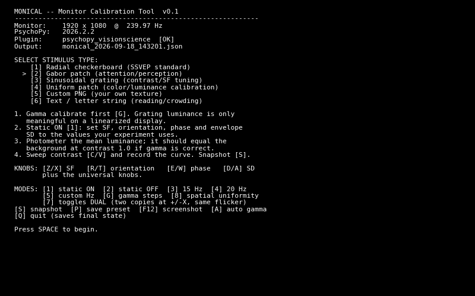
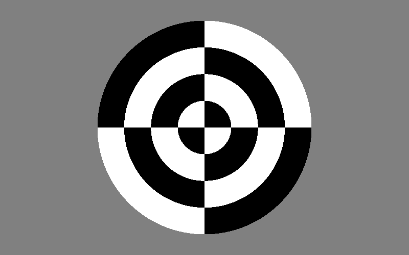
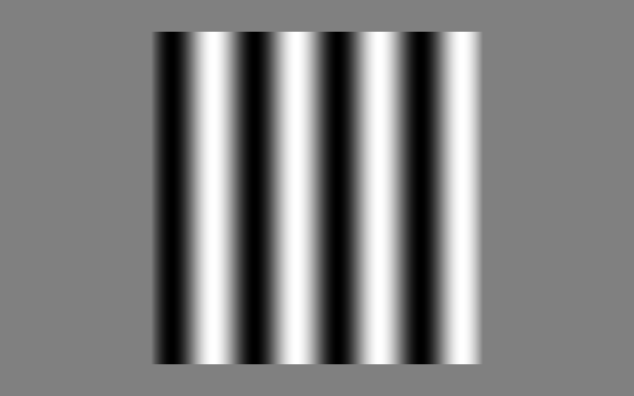
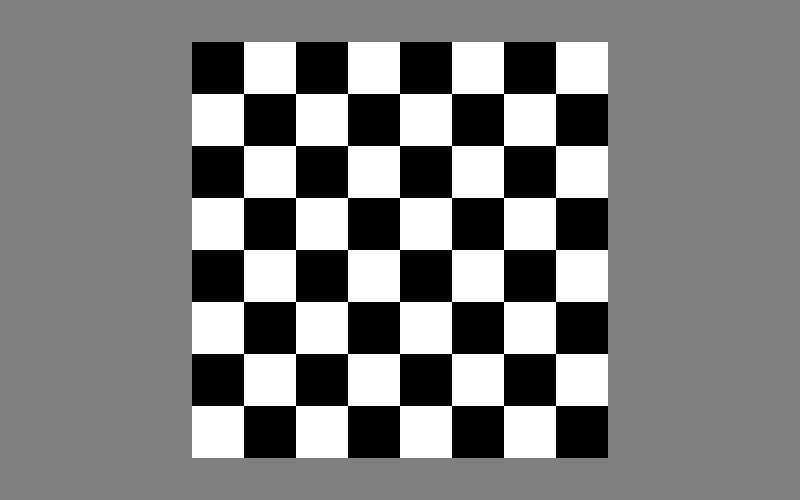
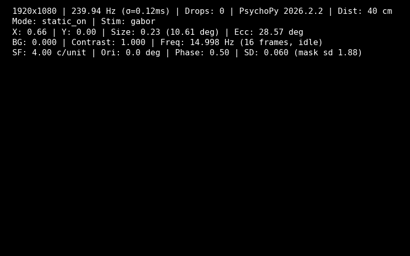

# Monical

Keyboard-driven monitor calibration for vision science: renders standard stimuli with every parameter adjustable live, and exports the values you measure to JSON.



## Install

PsychoPy is the only requirement. `psychopy_visionscience` is optional and needed only for the radial checkerboard:

```bash
pip install psychopy-visionscience
```

## Run

```bash
python monical.py
python monical.py --image assets/texture.png
```

Pick a stimulus type with `1`–`5`, press `SPACE`. No config files, no build step. Writes one file, `calibration_values.json`, beside the script.

## Stimulus types

| | |
|---|---|
| **Radial checkerboard** — SSVEP standard, 4×4 dartboard pattern (example). | **Gabor patch** — sinusoidal carrier under a Gaussian envelope. SF, orientation, phase, envelope SD. |
|  |  |
| **Sinusoidal grating** — the same carrier, no envelope. Contrast sensitivity, SF tuning. | **Uniform patch** — per-channel R/G/B and alpha (shown: green channel isolated). |
|  |  |
| **Custom PNG** — your own texture via `--image`. Without it, this generated 8×8 checkerboard. | |
|  | |

## Modes

`1` static ON · `2` static OFF · `3` flicker 15 Hz · `4` flicker 20 Hz · `5` flicker at the custom rate · `G` gamma steps (11 levels) · `8` spatial uniformity (3×3 grid) · `7` toggles dual stimuli at ±X

Flicker is driven by integer frame counts, so the readout always reports the **realized** frequency, never the requested one.

## Keys

| | |
|---|---|
| Arrows | move the stimulus, X/Y ±0.005 |
| `PAGEUP`/`PAGEDN` | background gray ±0.001 |
| `+`/`-` | size ±0.01 |
| `C`/`V` | contrast ±0.001 |
| `F`/`H` | custom frequency ±1 Hz |
| `;`/`'` | viewing distance ±1 cm |
| `Z/X` `R/T` `E/W` `D/A` | stimulus-specific (SF, orientation, phase, SD — or R, G, B, alpha) |
| `S` / `Q` | snapshot / quit and save |

Position, background, contrast and the color channels auto-repeat at ~60/s after a 1-second hold. Full table in [docs/MANUAL.md](docs/MANUAL.md#4-keybindings).

## Readout



Five lines, updated every frame: measured refresh with frame-interval σ and a dropped-frame counter, mode, geometry in degrees, luminance and realized flicker rate, then the active stimulus parameters.

The refresh figure is a rolling 120-frame average of real flip-to-flip intervals, not the startup measurement — if the two disagree by more than 5 Hz the tool says so, because every flicker frame count depends on getting it right.

## Output

`calibration_values.json`, rewritten on every snapshot and on quit. **Overwritten each run** — copy it out between sessions.

```json
{
  "note": "REFERENCE ONLY. Not loaded by any experiment. Values are read by humans and entered manually.",
  "session_start": "2026-09-11T13:03:21",
  "session_end": "2026-09-11T13:05:06",
  "monical_version": "0.1",
  "monitor_name": "testMonitor",
  "monitor_resolution": [3440, 1440],
  "monitor_width_cm": 30.0,
  "monitor_height_cm": 12.56,
  "color_space": "rgb",
  "units": "height",
  "window_fullscreen": true,
  "vsync": true,
  "vsync_detail": {
    "wait_blanking": true,
    "pyglet_vsync": true,
    "context_get_vsync": true
  },
  "startup_refresh_hz": 60.0,
  "final_rolling_refresh_hz": 59.972,
  "final_rolling_refresh_sd_ms": 0.5958,
  "total_dropped_frames": 1,
  "psychopy_version": "2026.2.2",
  "python_version": "3.11.0 (main, Oct 24 2022, 18:26:48) [MSC v.1933 64 bit (AMD64)]",
  "platform": "win32",
  "has_radial_stim": true,
  "image_path": null,
  "viewing_distance_cm": 40.0,
  "stimulus_type": "radial_checkerboard",
  "snapshots": [
    {
      "snapshot_number": 1,
      "timestamp": "2026-09-11T13:04:38",
      "rolling_refresh_hz": 60.01,
      "dropped_frames_total": 0,
      "stimulus_type": "radial_checkerboard",
      "mode": "static_on",
      "dual_stimulus": false,
      "x_position": 0.14,
      "y_position": -0.005,
      "background_gray": 0.0,
      "disc_size": 0.225,
      "contrast": 1.0,
      "custom_frequency_hz": 14,
      "visual_angle_deg": 4.05,
      "eccentricity_deg": 2.52,
      "stimulus_specific": {}
    }
  ],
  "final": {
    "snapshot_number": null,
    "timestamp": "2026-09-11T13:05:06",
    "rolling_refresh_hz": 59.972,
    "dropped_frames_total": 1,
    "stimulus_type": "radial_checkerboard",
    "mode": "static_on",
    "dual_stimulus": false,
    "x_position": 0.74,
    "y_position": 0.02,
    "background_gray": 0.0,
    "disc_size": 0.225,
    "contrast": 1.0,
    "custom_frequency_hz": 15,
    "visual_angle_deg": 4.05,
    "eccentricity_deg": 13.08,
    "stimulus_specific": {}
  }
}
```

Alongside the parameters, each session records the rig it was measured on — resolution, physical size, units, color space, vsync state, PsychoPy and Python versions — so the numbers stay interpretable later. Snapshots carry the rolling refresh rate and drop count at the moment they were taken, so you can tell whether timing was healthy for that reading.

Nothing reads this file back. You transcribe the values into your experiment by hand.

## Documentation

- [docs/MANUAL.md](docs/MANUAL.md) — operating manual: full keybindings, five step-by-step calibration workflows, output reference, troubleshooting.
- [docs/PRD.md](docs/PRD.md) — design authority: what each stimulus is, why, and the exact construction.

## What it is not

Not an experiment, not a monitor profiler, not automatic. It does not build or apply gamma tables — PsychoPy Monitor Center does that; Monical helps you collect the measurements. No photodiode input, no closed loop, no mouse, no GUI widgets.

## License

MIT.
